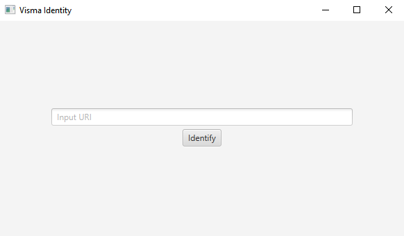
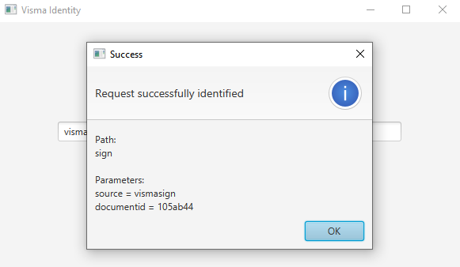
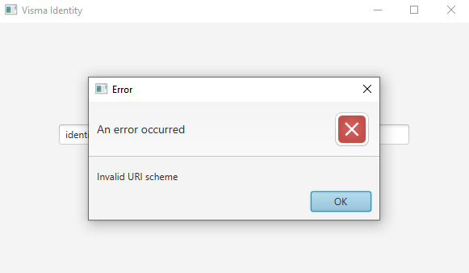

# Visma Identity
A task for the Visma Solutions - Summer Trainee 2023: Software Developer position. The objective of the task was to design and implement a class which is responsible for identifying what kind of requests an indentity management application receives and a client that uses the class. Other apps can call the identity app using the scheme visma-identity.

## How I understood the problem
I need to create a class that gets an URI and verifies that it's valid i.e., correct schema, path is either login, confirm or sign and that the URI has the needed parameters related to the path. If the URI is valid the class should be able to give the path as a string and parameters as key-value pairs. In addition I need to create another class that uses the given path and parameters. 

## Challenges
The first challenge I ran into was with how I should implement the client. The task description gave us carte blanche as it was quite vague on that part. I decided to implement a simple GUI with an address bar and a submit button that mimics a user sending a request. The second challenge I came across was Scala 3. This was the first time I tried the new version of Scala and it took some getting used to the new syntax. The bigger problem with Scala 3 was that I just couldn't get some of ScalaFX's features to work with it, thus building the GUI took more time than anticipated. Luckily Scala 3 is backward compatible and in the end I implemented the client with Scala 2.

## Improvements
- The method that parses the URI is quite big and not the most readable due to having a lot of conditionals. The part that matches the URI's path could probably be made into its own method.
- Adding checks to only allow unique parameters
- Tests for the client instead of manual testing

## How to run
You need to have sbt installed.

```
git clone
cd visma-identity
sbt run
```




